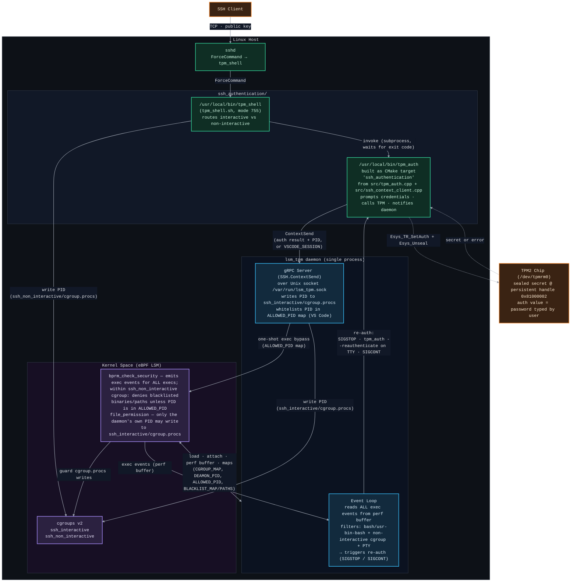

# lsm_tpm

## Prerequisites

1. stable rust toolchains: `rustup toolchain install stable`
1. nightly rust toolchains: `rustup toolchain install nightly --component rust-src`
1. (if cross-compiling) rustup target: `rustup target add ${ARCH}-unknown-linux-musl`
1. (if cross-compiling) LLVM: (e.g.) `brew install llvm` (on macOS)
1. (if cross-compiling) C toolchain: (e.g.) [`brew install filosottile/musl-cross/musl-cross`](https://github.com/FiloSottile/homebrew-musl-cross) (on macOS)
1. bpf-linker: `cargo install bpf-linker` (`--no-default-features` on macOS)

## Build & Run

Use `cargo build`, `cargo check`, etc. as normal. Run your program with:

```shell
cargo run --release
```

Cargo build scripts are used to automatically build the eBPF correctly and include it in the
program.

## Cross-compiling on macOS

Cross compilation should work on both Intel and Apple Silicon Macs.

```shell
CC=${ARCH}-linux-musl-gcc cargo build --package lsm_tpm --release \
  --target=${ARCH}-unknown-linux-musl \
  --config=target.${ARCH}-unknown-linux-musl.linker=\"${ARCH}-linux-musl-gcc\"
```
The cross-compiled program `target/${ARCH}-unknown-linux-musl/release/lsm_tpm` can be
copied to a Linux server or VM and run there.

## Manual setup

If you will connect with vscode remote explorer to machine running ebpf program.
1. Generate ssh key on client
2. Copy public key to the target machine
3. Add in /etc/ssh/sshd_config line
```shell
PermitUserEnvironment SSH_CLIENT_TYPE
```
4. Add in ~/.ssh/authorized_keys line
```shell
environment="SSH_CLIENT_TYPE=vscode" <public key>
```
5. On client side add vscode private key to config
```shell
Host <machine with ebpf running>
  ....
  IdentityFile <path_to_private_key>/<vscode_key_name>
  IdentitiesOnly yes
```
## Architecture Diagram



## Sequence Diagram

```mermaid
sequenceDiagram
    autonumber
    participant C  as SSH Client
    participant S  as sshd
    participant SH as tpm_shell
    participant TA as tpm_auth
    participant L  as lsm_tpm daemon
    participant B  as eBPF / Kernel
    participant T  as TPM2

    rect rgb(0, 90, 60)
        Note over L,B: Daemon startup
        L->>B: load & attach LSM programs
        L->>B: register cgroup IDs + binary blacklist
        B-->>L: ready — watching all exec events
    end

    rect rgb(60, 40, 130)
        Note over C,S: Phase 1 — SSH public key (1st factor)
        C->>S: connect + public key
        S->>C: challenge
        C->>S: signed response ✓
        S->>SH: invoke ForceCommand
    end

    SH->>SH: SSH_ORIGINAL_COMMAND set?

    alt non-interactive (scp · git · VS Code Remote)
        rect rgb(20, 70, 130)
            Note over SH,L: Phase 2a — classify session, no TPM challenge
            SH->>TA: tpm_auth --non-interactive
            TA->>L: ContextSend(NOT_TPM_AUTHENTICATED)
            L-->>TA: ok
            SH->>SH: place PID in ssh_non_interactive cgroup
            SH->>SH: exec original command
        end

    else interactive shell
        rect rgb(20, 70, 130)
            Note over SH,T: Phase 2b — TPM challenge (2nd factor)
            SH->>TA: tpm_auth --interactive
            TA->>C: Enter TPM username & password
            C->>TA: credentials
            TA->>T: Unseal secret with provided password
            T-->>TA: secret ✓  or  error ✗
            alt success
                TA->>L: ContextSend(OWNER_AUTHENTICATED)
                L->>L: place PID in ssh_interactive cgroup
                L-->>TA: ok
                SH->>C: open login shell
            else failure
                TA->>L: ContextSend(NOT_TPM_AUTHENTICATED)
                SH->>C: authentication failed — disconnect
            end
        end
    end

    rect rgb(130, 50, 20)
        Note over B,T: Phase 3 — Re-auth: non-interactive session opens a shell with PTY
        Note right of B: e.g. VS Code integrated terminal
        B->>B: shell exec detected in ssh_non_interactive + PTY present
        B->>L: security event (shell + non-interactive + PTY)
        L->>L: freeze the process
        L->>TA: tpm_auth --reauthenticate (on user's TTY)
        TA->>C: Enter TPM username & password
        C->>TA: credentials
        TA->>T: Unseal secret
        T-->>TA: result
        alt success
            TA->>L: ContextSend(OWNER_REAUTHENTICATED)
            L->>L: move PID to ssh_interactive cgroup
            L->>L: resume process
            Note right of L: session upgraded to interactive
        else failure
            TA->>L: ContextSend(NOT_TPM_AUTHENTICATED)
            L->>L: resume process (stays non-interactive)
            Note right of L: next shell exec will re-trigger challenge
        end
    end
```


## License

With the exception of eBPF code, lsm_tpm is distributed under the terms
of either the [MIT license] or the [Apache License] (version 2.0), at your
option.

Unless you explicitly state otherwise, any contribution intentionally submitted
for inclusion in this crate by you, as defined in the Apache-2.0 license, shall
be dual licensed as above, without any additional terms or conditions.

### eBPF

All eBPF code is distributed under either the terms of the
[GNU General Public License, Version 2] or the [MIT license], at your
option.

Unless you explicitly state otherwise, any contribution intentionally submitted
for inclusion in this project by you, as defined in the GPL-2 license, shall be
dual licensed as above, without any additional terms or conditions.

[Apache license]: LICENSE-APACHE
[MIT license]: LICENSE-MIT
[GNU General Public License, Version 2]: LICENSE-GPL2
